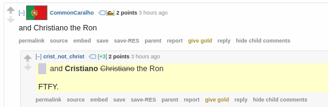

# christ2cris chatbot

A small tribute to, **unarguably**, the best football player of all time.

This program is a chat bot scanning for user comments on [reddit.com/soccer](https://www.reddit.com/r/soccer/), if comments contain typos of the form *Christiano* instead of *Cristiano*, a reply is sent with the fix.

For instance:

Can be easily deployed using the [Docker](https://www.docker.com/) image.
